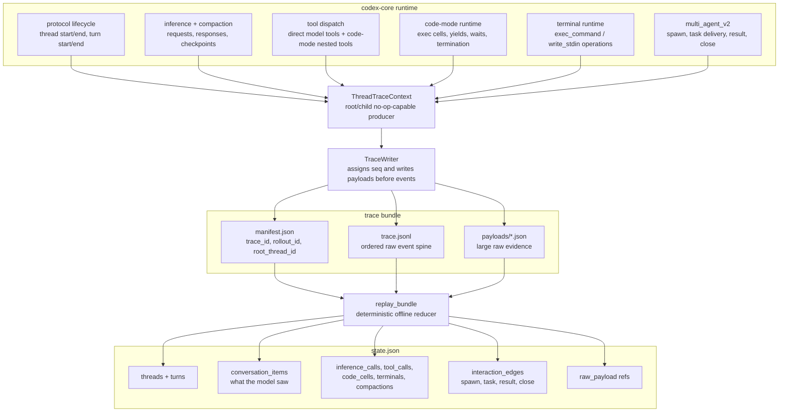
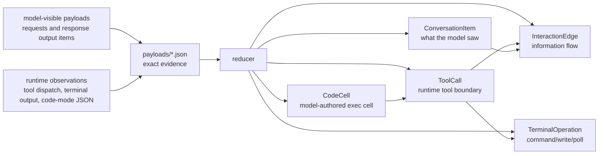
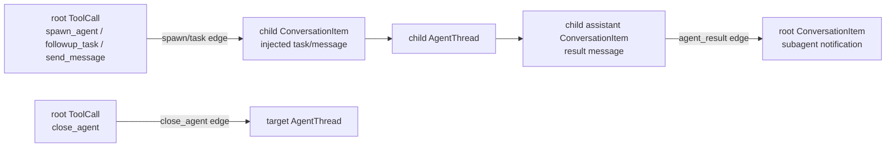

# Rollout Trace

> **Privacy:** Rollout tracing is not telemetry. Codex does **not** upload or
> report these traces; it writes local bundles only when
> `CODEX_ROLLOUT_TRACE_ROOT` is set. Those local bundles can contain prompts,
> responses, tool inputs/outputs, terminal output, and paths, so treat them as
> sensitive.

Rollout tracing is an opt-in diagnostic path for understanding what happened
during a Codex session. It records raw runtime evidence into a local bundle on
disk, then replays that bundle into a semantic graph that a debugger or UI can
inspect.

The key design choice is: **observe first, interpret later**.

Hot-path Codex code does not try to build the final graph while the session is
running. It writes ordered raw events and payload references. The offline reducer
then decides which events became model-visible conversation, which events were
runtime work, and how information moved between threads, tools, code cells, and
terminal sessions.

## What This Gives Us

Rollout traces make failures debuggable when the normal transcript is not enough.
They preserve enough evidence to answer questions like:

- Which model request produced this tool call?
- Did this output come from the model-visible transcript, a code-mode runtime
  value, a terminal operation, or an agent notification?
- Which code-mode `exec` cell issued a nested tool call?
- Which terminal operation created or reused a running process?
- Which multi-agent v2 tool call spawned, messaged, received from, or closed a
  child thread?

The reduced `state.json` is intentionally not just a transcript. It is a graph of
model-visible conversation plus the runtime objects that explain how Codex got
there.

## System Shape



The thread context is deliberately small and no-op capable. A root session starts
one from `CODEX_ROLLOUT_TRACE_ROOT`; fresh spawned child threads derive their
own context from the parent's context so the whole rollout tree shares one
writer. Disabled contexts accept the same calls and record nothing.

Trace startup and writes are best-effort. Rollout tracing must never make a
Codex session fail just because diagnostic recording failed. Core emits raw
observations; this crate owns the bundle schema, trace-context APIs, writer, and
reducer.

## Bundle Layout

A trace bundle contains:

- `manifest.json`: trace identity and bundle metadata.
- `trace.jsonl`: append-only raw events ordered by writer-assigned `seq`.
- `payloads/*.json`: raw requests, responses, tool inputs/results, runtime
  events, terminal output, compaction data, and protocol snapshots.
- `state.json`: optional reducer output written by `codex debug trace-reduce`.

`trace_id` identifies this diagnostic artifact. `rollout_id` identifies the
Codex rollout/session being observed. Keeping those separate lets us reason about
the stored trace without confusing it with the product-level session identity.

To reduce a bundle:

```bash
codex debug trace-reduce <trace-bundle>
```

By default this writes `<trace-bundle>/state.json`. Rust callers can also call
`codex_rollout_trace::replay_bundle` directly.

## Raw Evidence vs Reduced Graph



This distinction is the reason the model has both raw payload references and
semantic objects. A code-mode nested tool call, for example, has JSON input and
output at the JavaScript runtime boundary, but the model-visible transcript only
contains the surrounding `exec` custom tool call and its eventual output.

The reducer keeps those facts separate:

- `ConversationItem` records what appeared in model-facing requests/responses.
- `ToolCall`, `CodeCell`, `TerminalOperation`, `InferenceCall`, and
  `Compaction` record runtime/debug boundaries.
- `InteractionEdge` records information flow between objects, such as a
  `spawn_agent` tool call delivering a task into a child thread.
- `RawPayloadRef` points back to exact evidence when a viewer needs more detail
  than the reduced graph stores inline.

## Multi-Agent v2

Multi-agent v2 child threads share the root trace writer. That means one root
bundle reduces into one graph containing the parent thread, child threads, and
the edges between them.



Top-level independent threads still get independent bundles. Spawned child
threads are different: they are part of the same rollout tree, so they belong in
the same raw event log, payload directory, and reduced `state.json`.

## Reducer Invariants

The reducer is strict where the raw evidence should be self-consistent:

- raw events are replayed in `seq` order;
- payload files must exist before events refer to them;
- reduced object IDs are stable within one replay;
- runtime events may be queued until the model-visible source or delivery target
  has been observed;
- model-visible conversation is derived from model-facing payloads, not from
  runtime convenience output;
- runtime payloads are evidence, not proof that the model saw the same bytes.

Those invariants let the reduced graph stay small while preserving a path back
to the original evidence whenever a debugger needs to explain why an object or
edge exists.
